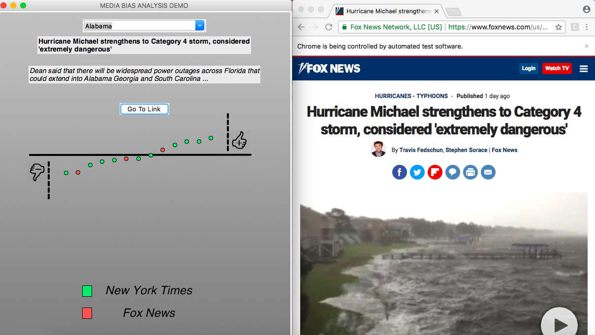

# ANALYZING MEDIA BIAS
## VISUALIZING SENTIMENT ANALYSIS DATA

### Project overview:   
This project uses natural language processing to compare articles published by two leading news sources: the New York Times and Fox News. Stanford’s CoreNLP Named Entity Recognizer was used to extract topics [1]. Sentiment analysis scores were calculated on individual sentences for each article using a combination of both NLTK’s VADER, which uses a bag-of-words approach [2], and Stanford’s CoreNLP Sentiment Treebank, which considers the syntax of a sentence [3].

A video demo of the GUI is linked to [here.](https://drive.google.com/open?id=1Gm5y23g_hNPraXA2QEq2dp0lLzKSRSi1) (x2 speed recommended)

### How to interpret the data:   
Dots represent articles which make reference to the topic listed at the top of the screen. Dots placed above the horizontal line mention the selected topic in a positive context, on average, while dots below the line mention the selected topic in a negative context, on average. Neutral topic mentions bring a dot closer to the line. TanH normalization is used on the overall sentiment score of an article. Articles are sorted by sentiment score, not by their publishing date.

### Current limitations:   
The sentiment scores displayed here do not necessarily represent the sentiment a given journalists wished to express about a particular topic. Rather, it represents the sentiment expressed in the overall context that a topic was mentioned in. Further work on this project will include identifying the intended object of expressed sentiment.

### Dependencies:
* Python 3 (Tested with version 3.6.5)
* Python packages:
	* Tkinter
	* OpenCV
	* Pillow
	* Selenium / webdriver
	* Numpy
	* SQLite3

### Usage with webdriver enabled:
`python3 media_bias_demo.py`

# Usage without webdriver enabled:
`python3 media_bias_demo_no_wd.py`

### Sources:

[1] “Sentiment Analysis.” NLTK Book, www.nltk.org/howto/sentiment.html.

[2] Jenny Rose Finkel, Trond Grenager, and Christopher Manning. 2005. Incorporating Non-local Information into Information Extraction Systems by Gibbs Sampling. Proceedings of the 43nd Annual Meeting of the Association for Computational Linguistics (ACL 2005), pp. 363-370. http://nlp.stanford.edu/~manning/papers/gibbscrf3.pdf

[3] Socher, R. Recursive Deep Models for Semantic Compositionality Over a Sentiment Treebank. Conference
      on Empirical Methods in Natural Language Processing.

# Media_Bias
Data collected, labeled, and presented by A. Houston Wingo.
